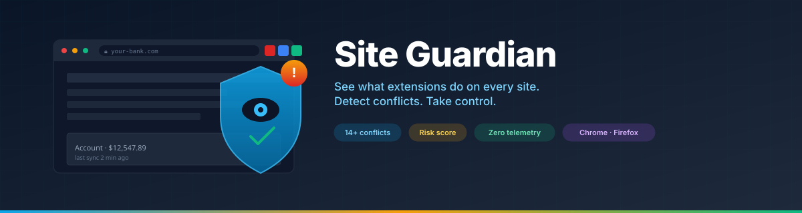
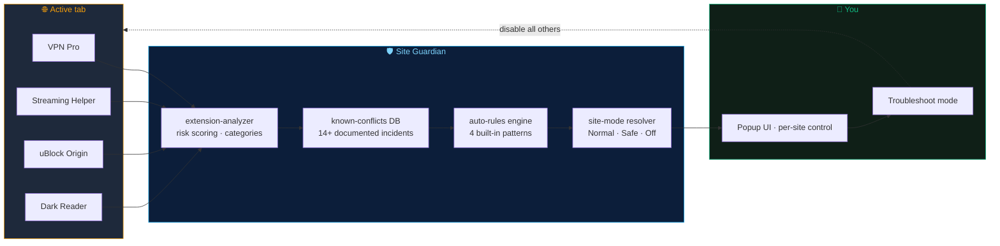
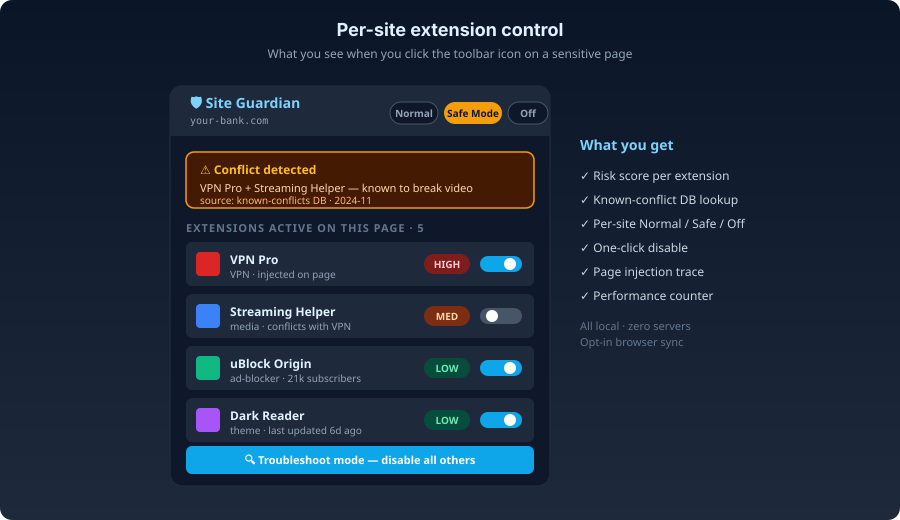

<div align="center">



[](./package.json)
[](#load-in-chrome)
[](#load-in-firefox)
[](#testing)
[](./PRIVACY.md)
[](./LICENSE)

**See what extensions do on every site. Detect conflicts. Take control.**

</div>

---

## Why this exists

Browser extensions are powerful and invisible — by design. The downside: you have no idea which one is reading your bank page, why two of them together broke YouTube last Tuesday, or which permissions a "harmless theme" actually requested. Most extension managers give you a flat list and an on/off toggle.

Site Guardian does three things the built-in manager doesn't:

1. **Show what's active on the page you're on right now** — with a risk score per extension.
2. **Detect known conflicts** — bundled database of 14+ documented incompatibilities (extension-vs-extension, extension-vs-site, category-vs-site).
3. **Let you act per-site** — Normal, Safe Mode, or Disabled, with smart auto-rules so banking sites get Safe Mode automatically.

All local. Zero servers. Opt-in browser sync if you want settings across devices.

---

## What's inside



<div align="center">
  
  <br/>
  <sub><i>The popup, on a sensitive page, with a conflict already detected.</i></sub>
</div>

---

## 🚀 Quick start

```bash
cd site-guardian
npm install
npm run build:chrome    # Chrome build
npm run build:firefox   # Firefox build
```

### Load in Chrome
1. `chrome://extensions` → Developer mode → Load unpacked → select `dist/`

### Load in Firefox
1. `about:debugging#/runtime/this-firefox` → Load Temporary Add-on → select `dist/manifest.json`

---

## Features

### Core
- **Extension monitor** — see which extensions inject scripts on the current page
- **Risk assessment** — each extension scored Low/Medium/High based on permissions and category
- **Conflict detection** — heuristic + known-conflict database with 14+ documented incompatibilities
- **Quick disable** — enable/disable any extension from the popup
- **Troubleshoot Mode** — one click to disable all other extensions and find the culprit
- **Per-site control** — Normal, Safe Mode, or Disabled for each website

### Advanced (v0.3)
- **Known Conflict Database** — bundled database of known extension-vs-extension, extension-vs-site, and category-vs-site conflicts with source attribution
- **Smart Auto-Rules** — automatic mode switching based on URL patterns (banking sites → Safe Mode, streaming + VPN → warning)
- **Browser Sync** — opt-in sync of settings via browser.storage.sync (Chrome/Google, Firefox/Firefox Sync)
- **Extension Categories** — auto-detection (ad-blocker, privacy-tool, VPN, AI assistant, etc.) with user tag overrides
- **Performance Monitoring** — page load time, LCP, script count, long tasks, resource transfer size, DOM complexity
- **DOM Injection Tracer** — opt-in MutationObserver detecting script/style/iframe injections with extension-origin attribution

### Privacy
- All data stored locally (or via browser's built-in sync — never our servers)
- Zero external network requests
- Zero analytics or telemetry
- Extension list analyzed locally and never transmitted

See [PRIVACY.md](./PRIVACY.md) for the full statement.

---

## Architecture

```
src/
├── core/                         # Pure logic (zero browser API calls)
│   ├── types.ts                  # All types, enums, constants
│   ├── storage.ts                # Storage CRUD with validation
│   ├── storage-backend.ts        # Sync/local routing abstraction
│   ├── extension-analyzer.ts     # Risk scoring, conflict detection, categories
│   ├── known-conflicts.ts        # Bundled conflict database (14+ entries)
│   ├── auto-rules.ts             # Smart rule engine (4 built-in rules)
│   ├── site-mode.ts              # URL parsing, mode resolution
│   ├── diagnostics.ts            # Diagnostic entry assembly
│   ├── messaging.ts              # 27 typed message contracts
│   └── browser-api.ts            # Cross-browser abstraction
│
├── background/index.ts           # Service worker (27 handlers, badge, lifecycle)
├── content/index.ts              # Error/perf monitor + DOM tracer (2KB)
├── popup/                        # Extension popup (React)
├── options/                      # Settings page (React)
├── onboarding/                   # First-run flow (React)
└── shared/                       # Hooks and UI components
```

---

## Permissions

| Permission | Why |
|------------|-----|
| `storage` | Save settings and per-site rules locally (+ optional sync) |
| `activeTab` | Read current tab URL when you interact with the extension |
| `tabs` | Keep status up-to-date as you navigate |
| `management` | List extensions, read permissions, enable/disable at your request |
| `scripting` | Inject page health monitor to collect errors and performance data |

---

## Development

```bash
npm run dev          # Watch mode
npm run typecheck    # TypeScript checking
npm test             # Run unit tests (132 tests)
npm run test:watch   # Tests in watch mode
```

---

## Testing

132 unit tests across 7 test files:
- Extension analyzer (pattern matching, risk scoring, conflicts)
- Known conflict database (ext-vs-ext, ext-vs-site, category-vs-site)
- Auto-rules engine (pattern matching, precedence, built-in rules)
- Storage backend (sync/local key classification)
- Hostname normalization and validation
- Diagnostics generation
- Type/enum integrity

Manual QA: see `docs/qa-checklist.md` (80+ scenarios).

---

## Browser compatibility

| Feature | Chrome | Firefox |
|---------|--------|---------|
| Extension monitoring | ✅ | ✅ |
| Risk assessment | ✅ | ✅ |
| Known conflicts | ✅ | ✅ |
| Auto-rules | ✅ | ✅ |
| Browser sync | ✅ (Google) | ✅ (Firefox Sync) |
| Badge counter | ✅ | ✅ |
| Page health (LCP, long tasks) | ✅ | ✅ (FF 122+/132+) |
| JS heap memory | ✅ | ❌ (returns unavailable) |
| DOM tracer | ✅ | ✅ |
| Minimum version | Any recent | 112+ |

---

## Contributing

Issues and pull requests welcome — particularly:

- New entries for the known-conflict database (with source attribution)
- Additional smart auto-rules for sensitive site categories
- Cross-browser test coverage for Edge / Brave / Vivaldi

---

## License

[MIT](./LICENSE)
